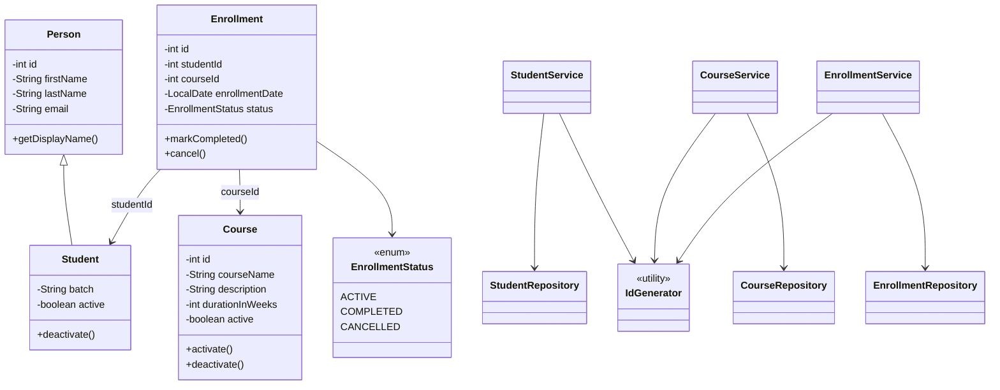

# LearnTrack – Student & Course Management System

LearnTrack is a console-based Java application built using Core Java concepts.  
It allows administrators to manage students, courses, and enrollments using a clean,
menu-driven interface.

This project focuses on Java fundamentals and OOP principles, without advanced frameworks.

---

##Features

- Add, view, and deactivate students
- Add, view, and deactivate courses
- Enroll students into courses
- View enrollments by student
- Update enrollment status (COMPLETED / CANCELLED)
- Graceful handling of invalid input and missing data

---

##Concepts Used

- Core Java
- OOP (Encapsulation, Inheritance, Polymorphism)
- Constructors & constructor overloading
- `static` variables and utility classes
- Collections (`ArrayList`)
- Custom Exceptions
- Menu-driven console application

---

##Project Structure

LearnTrack/
├── README.md
├── docs/
│   ├── Setup_Instructions.md
│   ├── JVM_Basics.md
│   └── Design_Notes.md
│
├── src/
│   └── com/
│       └── airtribe/
│           └── learntrack/
│               ├── Main.java
│               │
│               ├── entity/
│               │   ├── Person.java
│               │   ├── Student.java
│               │   ├── Course.java
│               │   └── Enrollment.java
│               │
│               ├── enums/
│               │   └── EnrollmentStatus.java
│               │
│               ├── repository/
│               │   ├── StudentRepository.java
│               │   ├── CourseRepository.java
│               │   └── EnrollmentRepository.java
│               │
│               ├── service/
│               │   ├── StudentService.java
│               │   ├── CourseService.java
│               │   └── EnrollmentService.java
│               │
│               ├── util/
│               │   └── IdGenerator.java
│               │
│               └── exception/
│                   ├── EntityNotFoundException.java
│                   └── InvalidInputException.java
│
└── .gitignore

---
## Class Diagram

<!-- Submission PR created as per assignment requirement -->
